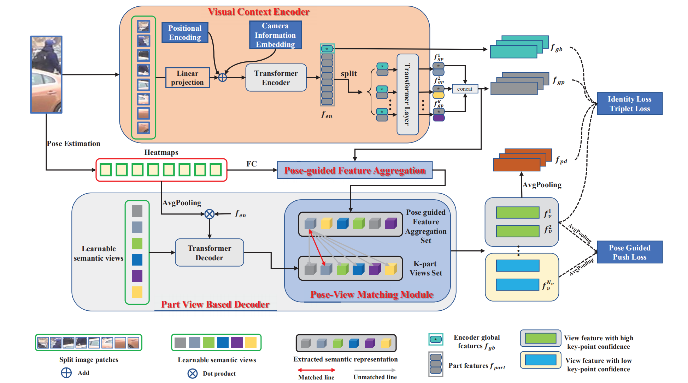

## **PFD：Pose-guided Feature Disentangling for Occluded Person Re-identification based on Transformer**

    

This repo is the official implementation of "**Pose-guided Feature Disentangling for Occluded Person Re-identification based on Transformer(PFD),  Tao Wang, Hong Liu$*$, Pinghao Song, Tianyu Guo& Wei Shi**" in PyTorch.

## Pipeline



## Dependencies

- timm==0.3.2

- torch==1.6.0

- numpy==1.20.2

- yacs==0.1.8

- opencv_python==4.5.2.54

- torchvision==0.7.0

- Pillow==8.4.0

#### Installation

```
pip install -r requirements.txt
```

If you find some packages are missing, please install them manually. 


## Prepare Datasets

```
mkdir data
```
Please download the dataset, and then rename and unzip them under the data

- [Occluded-Duke]()
- [Occluede-REID]()
- [Market-1501]()
- [DukeMTMC-reID]()
- [MSMT17]()

```
data
|--market1501
|
|--Occluded_Duke
|
|--Occluded_REID
|
|--MSMT17
|
|--dukemtmcreid
```

## Prepare ViT Pre-trained and HRNet Pre-trained Models

```
mkdir data
```
The ViT Pre-trained model can be found in [ViT_Base](https://drive.google.com/drive/folders/1bZinxHbxIghPNFlwQjkKfPR4SBcZgtYz?usp=sharing), The HRNet Pre-trained model can be found in [HRNet](https://drive.google.com/drive/folders/1iqXW84trCptYEELlVTB_KgYUCTqkJxsj?usp=sharinghttps://drive.google.com/drive/folders/1iqXW84trCptYEELlVTB_KgYUCTqkJxsj?usp=sharing), please download it and put in the './weights' dictory.


## Training
We use One GeForce GTX 1080Ti GPU for Training
Before train the model, please modify the parameters in config file, please refer to Arguments in  [TransReID](https://github.com/damo-cv/TransReID)
```
python occ_train.py --config_file {config_file path}
#example
python occ_train.py --config_file 'configs/OCC_Duke/skeleton_pfd.yml'
```


## Test the model

First download the Occluded-Duke model:[Occluded-Duke](https://drive.google.com/drive/folders/1a6q2nPDlX-ig8sWQh7uNYo1QfhhA2gGD?usp=sharing)

To test on pretrained model on Occ-Duke:
Modify the pre-trained model path (PRETRAIN_PATH:[ViT_Base](https://drive.google.com/drive/folders/1bZinxHbxIghPNFlwQjkKfPR4SBcZgtYz?usp=sharing), POSE_WEIGHT:[HRNet](https://drive.google.com/drive/folders/1iqXW84trCptYEELlVTB_KgYUCTqkJxsj?usp=sharinghttps://drive.google.com/drive/folders/1iqXW84trCptYEELlVTB_KgYUCTqkJxsj?usp=sharing), WEIGHT:[Occluded-Duke]((https://drive.google.com/drive/folders/1a6q2nPDlX-ig8sWQh7uNYo1QfhhA2gGD?usp=sharing))) in yml, and then run:

```
## OccDuke for example
python test.py --config_file 'configs/OCC_Duke/skeleton_pfd.yml'
```


#### Occluded-Duke Results
| Model         | Image Size|Rank-1 | mAP |
| :------:      | :------:  |:------: | :------: |
|  HOReID       | 256*128   | 55.1 | 43.8|
|  PAT          | 256*128   | 64.5 | 53.6|
| TransReID     | 256*128   | 64.2 | 55.7|
| **PFD**       | 256*128   | **67.7** | **60.1**|
| TransReID*    | 256*128   | 66.4 | 59.2|
| **PFD$*$**       | 256*128   | **69.5** | **61.8**|

$*$means the encoder is with a small step sliding-window setting

#### Occluded-REID Results
| Model         | Image Size|Rank-1 | mAP |
| :------:      | :------:  |:------: | :------: |
|  HOReID       | 256*128   | 80.3 | 70.2|
|  PAT          | 256*128   | **81.6** | 72.1|
| **PFD**       | 256*128   | 79.8 | **81.3**|

#### Market-1501 Results
| Model         | Image Size|Rank-1 | mAP |
| :------:      | :------:  |:------: | :------: |
|  HOReID       | 256*128   | 80.3 | 70.2|
|  PAT          | 256*128   | 95.4 | 88.0|
|  TransReID    | 256*128   | 95.4 | 88.0|
| **PFD**       | 256*128   | **95.5** | **89.6**|


## Citation

If you find our work useful in your research, please consider citing this paper! (preprint version will be available soon)

<!-- ```
@article{li2021mhformer,
  title={Pose-guided Feature Disentangling for Occluded Person Re-identification Based on Transformer},
  author={Li, Wenhao and Liu, Hong and Tang, Hao and Wang, Pichao and Van Gool, Luc},
  journal={arXiv preprint arXiv:2111.12707},
  year={2021}
}
``` -->

## Acknowledgement

Our code is extended from the following repositories. We thank the authors for releasing the codes.

- [TransReID](https://github.com/damo-cv/TransReID)
- [HRNet](https://github.com/stefanopini/simple-HRNet)

## License

This project is licensed under the terms of the MIT license.